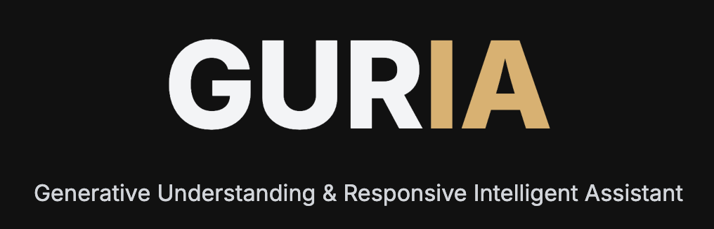

<div align="center">
  
  <p><strong>Generative Understanding & Responsive Intelligent Assistant</strong></p>
  <p><i>A powerful and intuitive chat interface for Ollama models</i></p>

  [](https://opensource.org/licenses/MIT)
  [](https://www.python.org/downloads/)
  [](https://flask.palletsprojects.com/)
  [](http://makeapullrequest.com)
  [](https://github.com/vinipx/guria-ai-app/graphs/commit-activity)
  [](https://github.com/vinipx/guria-ai-app)
</div>

---

## 🌟 Features

- 🎨 Modern, responsive UI with dark mode support
- 🔄 Real-time chat interface with streaming responses
- 🔒 Secure HTTPS with auto-generated SSL certificates
- 📱 Mobile-friendly design
- 💾 Local chat history storage
- 📤 Export chats to multiple formats (PDF, Markdown, Text)
- 🎯 Multiple Ollama model support
- 🔐 Privacy-focused (all data stays local)
- 🚀 Easy setup with automated installation script
- 💻 Cross-platform support (Windows, macOS, Linux)

## 🚀 Quick Start

GURIA comes with a smart setup script that handles everything for you! No need to manually install prerequisites - the script will check and install what's needed.

1. Clone the repository:
```bash
git clone https://github.com/vinipx/guria-ai-app.git
cd guria-ai-app
```

2. Run GURIA:

**On Windows:**
```powershell
.\guria
```

**On macOS/Linux:**
```bash
./guria
```

That's it! The script will automatically:
- Check and install prerequisites (Python, Ollama, etc.)
- Set up the virtual environment
- Install all dependencies
- Generate SSL certificates for secure HTTPS
- Configure the application
- Start the server

Your default web browser will open to `https://localhost:7860` when everything is ready.

> **Note about HTTPS**: GURIA uses HTTPS for secure local development. The setup script will attempt to use `mkcert` to create a properly trusted certificate. If successful, your browser will show a secure connection. If `mkcert` installation fails, it will fall back to a self-signed certificate, in which case you'll see security warnings that you can safely bypass:
> 
> **If you see security warnings:**
> 
> **Chrome/Edge**:
> 1. Click anywhere on the warning page
> 2. Type "thisisunsafe" (you won't see what you're typing)
> 3. The page will load automatically
>
> **Firefox**:
> 1. Click "Advanced..."
> 2. Click "Accept the Risk and Continue"
>
> **Safari**:
> 1. Click "Show Details"
> 2. Click "visit this website"
> 3. Click "Visit Website" in the popup
> 4. Enter your computer's password if prompted
>
> To avoid these warnings, you can manually install `mkcert`:
> ```bash
> # macOS
> brew install mkcert
> brew install nss  # for Firefox support
> 
> # Linux (Ubuntu/Debian)
> sudo apt-get install libnss3-tools
> curl -JLO "https://dl.filippo.io/mkcert/latest?for=linux/amd64"
> chmod +x mkcert-v*-linux-amd64
> sudo cp mkcert-v*-linux-amd64 /usr/local/bin/mkcert
> ```
> Then run the GURIA script again to generate trusted certificates.

### Platform Support

GURIA works seamlessly across all major platforms:
- ✅ **Windows**: Native support via PowerShell (Windows 10/11)
- ✅ **macOS**: Full support for both Intel and Apple Silicon
- ✅ **Linux**: Compatible with all major distributions
- ✅ **WSL**: Windows Subsystem for Linux supported

## 🎯 Usage

Just run the GURIA script and you're good to go:
```bash
# Windows
.\guria

# macOS/Linux
./guria
```

The script will ensure Ollama is running and handle everything else for you!

## 🛠️ Technology Stack

- **Backend**: Flask 3.0.0
- **Frontend**: HTML5, TailwindCSS, JavaScript
- **AI Integration**: Ollama API
- **Database**: SQLite
- **PDF Generation**: ReportLab
- **Process Management**: psutil

## 🔧 Configuration

GURIA is designed to work out of the box, but you can customize:

- Port number (default: 5000)
- Ollama API endpoint (default: http://localhost:11434)
- Available models (automatically detected from Ollama)
- Export formats and styling

## 📦 Project Structure

```
guria-ai-app/
├── app.py              # Main Flask application
├── templates/          # HTML templates
├── static/            # Static assets
├── setup/             # OS-specific setup scripts
│   ├── mac_setup.sh   # macOS/Linux setup
│   └── windows_setup.ps1  # Windows setup
├── guria              # Main setup script
├── requirements.txt   # Python dependencies
└── README.md         # This file
```

## 🤝 Contributing

Contributions are welcome! Please feel free to submit a Pull Request. For major changes, please open an issue first to discuss what you would like to change.

1. Fork the Project
2. Create your Feature Branch (`git checkout -b feature/AmazingFeature`)
3. Commit your Changes (`git commit -m 'Add some AmazingFeature'`)
4. Push to the Branch (`git push origin feature/AmazingFeature`)
5. Open a Pull Request

## 📝 License

This project is licensed under the MIT License - see the [LICENSE](LICENSE) file for details.

## 🙏 Acknowledgments

- [Ollama](https://ollama.ai/) for providing the amazing AI models
- [Flask](https://flask.palletsprojects.com/) for the web framework
- [TailwindCSS](https://tailwindcss.com/) for the styling system

## 📧 Contact

Vinicius Peixoto - [@vinipx](https://github.com/vinipx)

Project Link: [https://github.com/vinipx/guria-ai-app](https://github.com/vinipx/guria-ai-app)

---

<div align="center">
  <sub>Built with ❤️ by <a href="https://github.com/vinipx">Vinicius Peixoto</a></sub>
</div>
